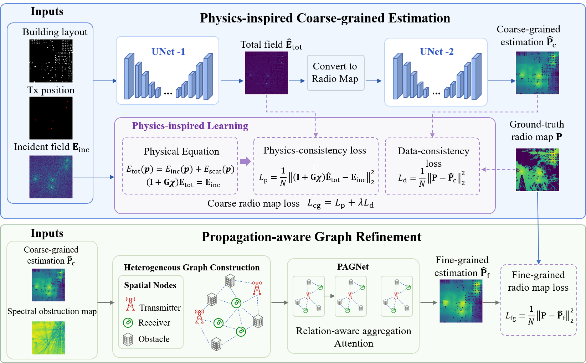

# PIHG: Physics-Inspired Heterogeneous Graph Neural Networks for Multi-band Radio Map Prediction

Official implementation of **PIHG**:Physics-Inspired Heterogeneous Graph Neural Networks for Multi-band Radio Map Prediction.

> Radio maps are instrumental in optimizing wireless network performance by providing spatial
> distributions of signal power. However, predicting multi-band radio maps across diverse
> environments remains challenging, as propagation behaviors vary significantly with frequency and
> environmental complexity. PIHG incorporates physical knowledge into the learning process for
> coarse-grained radio map estimation, and further refines the prediction using a propagation-aware
> heterogeneous graph that models environment-dependent spatial dependencies among transmitters,
> receivers, and obstacles.

PIHG follows a **coarse-to-fine** paradigm:

1. **Physics-inspired coarse-grained estimation.** A UNet cascade estimates the total electric
   field under a Volume Integral Equation (VIE) consistency constraint and converts it into a
   coarse radio map.
2. **Propagation-aware graph refinement.** A heterogeneous graph built from the Spectral
   Obstruction Map (SOM) and spatial proximity is processed by PAGNet (relational graph attention)
   to produce the fine-grained radio map.

---

## Overview



### Where each block lives in the code

| Component in the diagram | Code |
| --- | --- |
| End-to-end model `Phy_CNN_Graph` | [cnn_rgat_modules.py](cnn_rgat_modules.py) |
| UNet-1 / UNet-2 (`MyUNet`) | [myradioUNet_modules.py](myradioUNet_modules.py) |
| PAGNet (`RGAT_HeteroNode_1`) | [cnn_rgat_modules.py](cnn_rgat_modules.py) |
| `L_p` operator `(I + G·chi)E_tot` | [phy_vie_fft.py](phy_vie_fft.py) |
| Incident field `E_inc`, contrast `chi`, dense `W` | [SpectrumNet/gen_incident_field.py](SpectrumNet/gen_incident_field.py) |
| Spectral Obstruction Map (radio depth) | [SpectrumNet/gen_radio_depth.py](SpectrumNet/gen_radio_depth.py) |
| Block splitting + node features | [SpectrumNet/gen_node_feature.py](SpectrumNet/gen_node_feature.py) |
| Edge construction / adjacency | [SpectrumNet/gen_spect_adj.py](SpectrumNet/gen_spect_adj.py), [SpectrumNet/gen_spect_adj_old.py](SpectrumNet/gen_spect_adj_old.py) |
| Node/edge typing (3 types, 6 relations) | `generate_edge_type` in [SpectrumNet/utils.py](SpectrumNet/utils.py) |
| Dataset / graph loading | [SpectrumNet/load_data.py](SpectrumNet/load_data.py) |
| Training (both stages) | [train.py](train.py) |
| Evaluation | [test.py](test.py) |

### Key design points

**Matrix-free VIE operator.** The Green-function coefficient matrix `W` depends only on pairwise
distances, and the grid is regular, so `W` is a BTTB matrix and `W @ v` is exactly a 2-D
convolution. [phy_vie_fft.py](phy_vie_fft.py) evaluates it by circulant embedding + FFT: only a
`256 x 256` complex kernel spectrum per frequency (~0.5 MB) is stored instead of a
`16384 x 16384` complex128 matrix (~4.3 GB **per frequency**). The result is identical to the dense
product up to numerical precision — run `python phy_vie_fft.py` to verify (rel. err ~1e-16 in
complex128, ~1e-7 in complex64).

**Heterogeneous graph.** Node types are `0 = obstacle (building)`, `1 = receiver`,
`2 = transmitter`; the 6 relations are the unordered type pairs
(`0-0, 0-1, 0-2, 1-1, 1-2, 2-2`). An edge exists when two nodes are close in both SOM value and
space (Eq. 17). Each `128 x 128` region is partitioned into `16` blocks of `32 x 32`, PAGNet runs
per block, and the blocks are re-assembled into the full map.

---

## Repository structure

```
PIHG/
├── train.py                        # training entry point (both stages)
├── test.py                         # evaluation entry point (MSE/NMSE/RMSE/SSIM/PSNR)
├── cnn_rgat_modules.py             # Phy_CNN_Graph (PIHG) + PAGNet variants
├── myradioUNet_modules.py          # UNet encoder/decoder used as UNet-1 / UNet-2
├── phy_vie_fft.py                  # matrix-free VIE operator (FFT); self-check in __main__
├── SpectrumNet/                    # dataset construction and loading
│   ├── readPng.py                  # parse radio-map PNG + metadata from the file name
│   ├── readNpz.py                  # parse building/terrain NPZ + metadata
│   ├── tx_process.py               # transmitter coordinates and power maps
│   ├── utils.py                    # path helpers, frequency/height codes, edge typing
│   ├── create_area_dataset.py      # match PNG <-> NPZ <-> Tx, filter by scenario/height
│   ├── gen_radio_depth.py          # Spectral Obstruction Map (radio depth), + data split
│   ├── gen_incident_field.py       # E_inc, chi (and optionally dense W), + data split
│   ├── gen_node_feature.py         # split maps into 32x32 blocks, build node features
│   ├── gen_spect_adj.py            # adjacency from distance + SOM difference (parallel)
│   ├── gen_spect_adj_old.py        # adjacency variants (distance / depth / building / Tx)
│   ├── comb_area_dataset.py        # merge per-scenario splits into area _{train,valid,test}.txt
│   ├── create_block_dataset.py     # block-level dataset lists
│   ├── dataset_split.py            # per-frequency subsets
│   └── load_data.py                # SpectrumDataset / SpectrumDatasetField
├── dataset/SpectrumNet/*.txt       # dataset index files (tab-separated paths)
└── results/<data>/<model>/<scen>/  # checkpoints, logs, metrics
```

---

## Requirements

Tested with Python 3.10 and CUDA 12.1 on NVIDIA GeForce RTX 3090.

| Package | Version |
| --- | --- |
| torch | 2.5.1+cu121 |
| torch-geometric | 2.6.1 |
| torchmetrics | 1.7.1 |
| numpy | 1.26.4 |
| scipy | 1.15.2 |
| numba | 0.61.2 |
| scikit-image | 0.25.2 |
| networkx | 3.2.1 |
| pandas | 2.2.3 |
| matplotlib | 3.8.4 |
| Pillow | 10.2.0 |
| natsort | 8.4.0 |
| tqdm | 4.64.1 |
| bresenham | — |

```bash
conda create -n pihg python=3.10 -y && conda activate pihg
pip install torch==2.5.1 --index-url https://download.pytorch.org/whl/cu121
pip install torch-geometric==2.6.1
pip install torchmetrics numpy scipy numba scikit-image networkx pandas \
            matplotlib pillow natsort tqdm bresenham tensorboard
```

---

## Dataset preparation

## Dataset

PIHG is evaluated on the public multi-band radio map benchmark
**SpectrumNet** (Zhang *et al.*, *IEEE TCCN* 2025): 15,300 real-world building maps over 11 terrain
scenarios, `1.28 km x 1.28 km` per region at 10 m resolution (`128 x 128` grids), 5 carrier
frequencies (150 MHz, 1.5 GHz, 1.7 GHz, 3.5 GHz, 22 GHz). We use the ground-level (1.5 m) maps.
Received power is normalized to `[0, 1]`, where `0 = -120 dBm` and `1 = 60 dBm`. The SpectrumNet data can be found
in [SpectrumNet](https://spectrum-net.github.io/).

The cross-dataset experiments additionally use
[RadioMapSeer](https://radiomapseer.github.io/) and
[UrbanRadio](https://github.com/UNIC-Lab/UrbanRadio3D).

### Expected raw layout

Scripts default to `/root/autodl-tmp/SpectrumNet/`; edit the paths in the `__main__` block of each
script to point at your copy.

```
/root/autodl-tmp/SpectrumNet/
├── png/<scenario>/T06C2D0054_n01_f04_ss_z00.png   # radio map (ground truth)
├── npz/T06C2D0054_n01_bdtr.npz                    # building + terrain
├── tx_info.txt                                    # transmitter metadata
├── tx/ , tx_dB/                                   # generated by tx_process.py
├── depth/                                         # generated by gen_radio_depth.py
├── incField_10.0/                                 # generated by gen_incident_field.py
├── splitRSS_32/                                   # generated by gen_node_feature.py
└── disdepthAdj_32/                                # generated by gen_spect_adj_old.py
```

Run every script **from the repository root**:

```bash
python SpectrumNet/tx_process.py            # transmitter coords + power maps
python SpectrumNet/create_area_dataset.py   # pair PNG/NPZ/Tx, filter scenario + height
python SpectrumNet/gen_radio_depth.py       # SOM / radio depth, writes the per-scenario split
python SpectrumNet/gen_incident_field.py    # E_inc + chi, appends the incField column
python SpectrumNet/gen_node_feature.py      # 32x32 blocks and node features
python SpectrumNet/gen_spect_adj_old.py     # adjacency matrices -> disdepthAdj_32/
python SpectrumNet/comb_area_dataset.py     # merge all scenarios into area _*.txt
```

> `gen_spect_adj.py` uses package-style imports and must be run as a module instead:
> `python -m SpectrumNet.gen_spect_adj`. It is the multiprocessing version of the adjacency step;
> note that its `main()` is not called from `__main__`, and it writes to `disAdj<dth>_32/` rather
> than the `disdepthAdj_32/` that the loader expects — enable `main()` and align the output
> directory name if you prefer it over `gen_spect_adj_old.py`.

### Index-file format

Each line of `dataset/SpectrumNet/*.txt` is five tab-separated absolute paths, consumed in this
order by `SpectrumDatasetField.__getitem__`:

| Column | Content |
| --- | --- |
| 0 | radio-map PNG (ground truth; frequency and height are encoded in the file name) |
| 1 | building/terrain NPZ |
| 2 | transmitter power map `.npy` |
| 3 | radio depth / SOM `.npy` |
| 4 | incident-field NPZ (`E_inc_trad_2channel`, `chi`) |

---

## Training

Training is **two-stage**, both driven by [train.py](train.py) via the `isGraph` flag at the top of
`__main__`.

### Stage 1 — physics-inspired coarse estimation (`isGraph = False`)


```bash
python train.py     # with isGraph = False
# -> results/SpectrumNet/PIHG<lambda>/area /pretrain/{best_model.pt,train.txt,result.txt}
```

### Stage 2 — graph refinement (`isGraph = True`)


```bash
python train.py     # with isGraph = True
# -> results/SpectrumNet/PIHG<lambda>/area /train/{best_model.pt,train.txt,result.txt}
```

## Evaluation

```bash
python test.py
```

Reports MSE, NMSE, RMSE, SSIM and PSNR over the test set and appends them to
`results/<data_name>/<model_name>/<scen>/test.txt`. Set `train_folder_path` in `test.py` to the
directory holding the stage-2 `best_model.pt`. `fig_show_save()` renders a
*building | prediction | ground truth* panel if you want qualitative figures.

---


## Contact
If you have any questions or want to use the code, feel free to contact:
* Jiang Xinyue (xyuejiang@hnu.edu.cn, shirleyuue@foxmail.com),College of Computer Science and Electronic Engineering,
Hunan University.